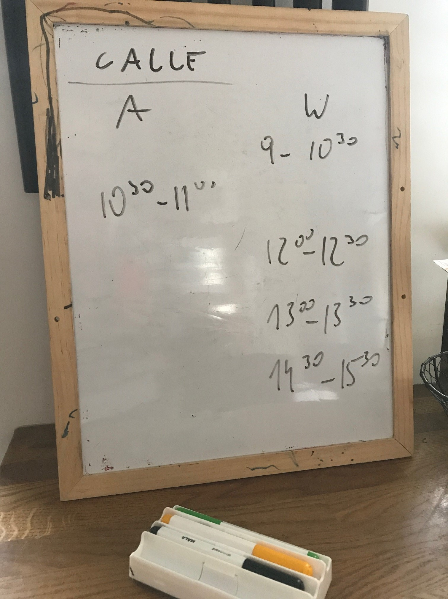
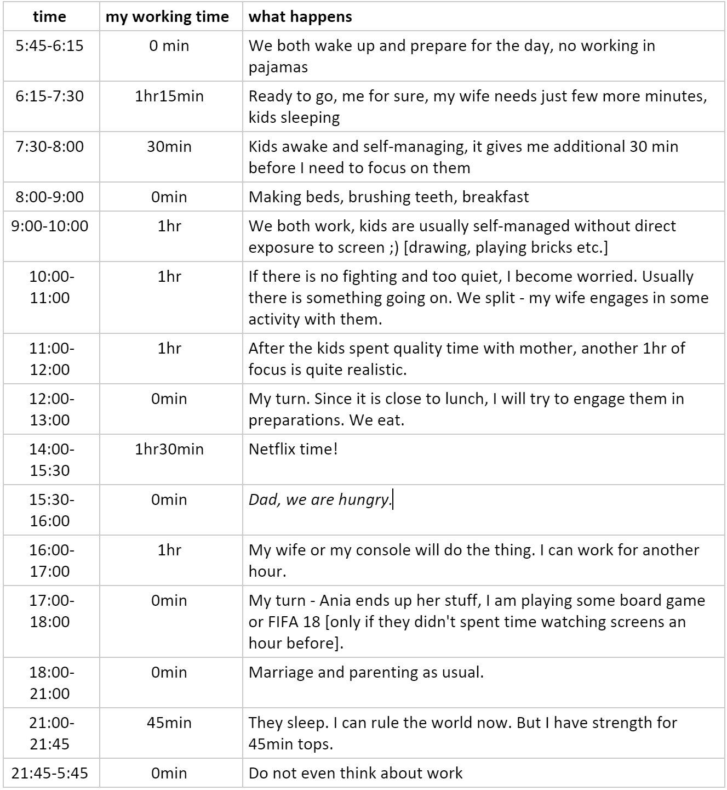

# WorkFromHome

*This repository contains helpful hints related with "Work From Home" strategy. Please do not hesitate to contribute!*

## Below main chapters are covered:

#### 1.	Full house: hints for remote working parents 
#### 2.	Planning your new scheme
#### 3. Activities for kids  
#### 4.	Other resources

## Full house: hints for remote working parents 

#### It happened. Now you work from home with your partner and kids.

For most of us it requires effort. The Internet is now literally loaded with tips on setting up an effective environment for your home office. Companies that went 100% remote share their stories, manuals etc. You shared some tips too. I went through that and here is a wrap up. It will not work for everybody, but hope at least some of you will find it helpful. I am also sharing my story, how I put it into practice. 

 
##### 1. Accept limitations 

Your working day will not be the same as when you worked from office. Struggling to find peace and quiet from 9am to 5pm, you will most probably end up with frustration. You have to do things differently. Accept it. 

 

##### 2. Plan your new scheme 

Most typically you stayed at home with your partner, who also needs to adapt to deliver remote work - respect that. Depending on your situation [household setup, kids or other responsibilities] there will be different things to cope with. Have a cup of coffee or a glass of wine together and name them. Make a list. Figure out how to manage them. Here is my real-life example: Planning your new scheme 

 

##### 3. Plan your next day and include your kids in it 

Each working day will bring specific critical moments for you and your partner - a call with a customer can be a good example. Make a schedule for each day, managing the critical moments: 

include kids in your daily plan, plan your work to have time for them and still do your 8hrs  

save the most effective ways to engage kids for the critical events: your partner, TV series etc. - check out this list, maybe you will find something interesting : Activities for kids] 

literally put a placeholder for kids in your calendar around critical events [e.g. call with customer 11:30AM-12:30PM, book 11:15-11:30 for the kids, prepare them for the situation, book another 15 minutes after the call for them only 

 

##### 4. Discuss the plan with kids and make it visual 

If you have kindergarten kids, than visualizing something abstract like day schedule can help to go smoothly through the day. You need a small whiteboard, blackboard or simply a sheet of paper.  

Create it together, the creative way [incl. drawing, sticking, gluing etc.]- what and when will happen, what is the time for you to play together and when it is not. "Relax kid, there will be time for your favorite game, even more than before!"  

Refer to that visuals later on.  

Will it definitely save your day? No, but it will help. 

 

##### 5. Support each other and recognize effort 

Recall the power of Thank you! Use it often. Recognize your partner, your kids for the effort they made. Be kind to each other. Simply that. 

 

##### 6. Be tolerant and do not hesitate to ask for tolerance 

Things like that will happen: Ellen Dissects the Kid-Interrupted BBC Interview. And this is OK. Tell other call participants about your situation. Don't turn your camera off, you don’t have to do that. Mute your mic if you are not a speaker at the moment and your kids are just about to invade Tatooine. Ask for a minute of break if needed. Play with it, don't get frustrated. It is not only you, who struggle this. 

 

##### 7. Learning new habits takes time 

Be prepared that first few days can be difficult. Be patient and supportive. Ask for that support openly. This is a learning experience. Follow the plan but be flexible - adapt. Play with different scenarios to work out the best scheme for your family. 

## Planning your new scheme 

*This is special section written by Predica employee - Wiesław Szydło how he is managing the chaos with his two sons - real case!*

Each of us has to find the way that suits best. Here is how I am doing it. 

My kids [Alek 7yo., Staszek 6yo.] get bored, yours too? And when they do, they start fight over something abstract like "did the dinosaurs die because of the new coronavirus". My wife [Anna, she's been around a bit] is highly-reactive person, meaning while I can focus in virtually any conditions, she is distracted by kids laughing next room. If we won't plan a scheme, we will end up somewhere in the darkside around Wednesday.  

**Objective**

Reduce situations when kids go crazy and we can't work

**How we plan to achieve it?**

* kids are left with some highly self-engaging activity [the only way to manage situation when we both are taking calls or need to focus] 

* one of us is engaged with kids in an activity [most effective in creating conditions to focus for the other partner] 

* both of us are engaged with kids in an activity [works only if no critical tasks like calls are to be delivered]

**What do we need to succeed?**

we are open to plan our day differently than usual: 

* organize our working time to save some space for kids during the day 

* try do maximize productivity of the time we spent on commuting   

* be more flexible with our working hours 

* accept fact that maybe we will have to start our day earlier than usual

**we will split duties:**

* when needed, one of us will make a break and involve in activities with kids, so that the other can continue work 

* we agree on the rule "call has a priority, self-work is flexible" and support each other accordingly to that rule  

* we made calls time visual to help us following that [kid's IKEA whiteboard reinvented, guess who is working in HR]: 

**we look for available working space in our 64m2 flat:**

* bedroom: fine, quiet, good for call or up to 1,5hrs of undisrupted work [more than that will end up in backache], weak wi-fi [need for hotspot] 

* kitchen/ living room: most preferred, as the dining table is the only adult-sized-desk we have, good wi-fi, close to coffee machine; cons: the only room with the TV and console, and we don't want to change that [we simply need to take it into consideration when scheduling calls etc.] 

* kids' room: conditions same as in bedroom 

* balcony - good place to take quick calls, but be careful with sensitive customer info when talking loud  

**kids are more easy to handle when separated:**

* our kids share one room, so we will try to create equally attractive space for them to play separated 

* we will prepare self-engaging activities [I put some collected ideas here: Self-engaging activities for kids] 

* if needed, we will split kids and we are gonna:

* involve them in different self-engaging, learning activities and encourage to share this knowledge later 

* make them prepare a different kind of puzzles for each other - hopefully they will spend some time resolving them ;) 

**My new schedule**

This is how I plan to manage it this week [a general idea, before each day I plan the next day in details with my wife] 

**Just a framework, I accept fact that it may not work that way every day and I am ready to improvise.**

Alek (left) and Staszek (right). What can possibly go wrong? ;) 

## Activities for kids

Devices and Internet make photos of cats accessible more than ever, but they also give us access to the world's knowledge. At the moment different institutions and platforms are opening their repositories offering interesting on-line courses targeted at wide audiences, including our kids.  

And don't forget about the good old off-line stuff you can offer your kids! 

We went through the Internet to grab some ideas. Here are some that appealed most to us.  

Work in progress, we will update each time we find something interesting. 

### Self-engaging, on-line

**Education** 

 
https://drive.google.com/file/d/15_HRFtY2DSPUmJnKSBn_64vlwbL8wqmi/view 

List of interesting educational youtube channels, both PL and EN. 

[www.khanacademy.org](www.khanacademy.org) – nonprofit with the mission to provide a free, world-class education for anyone, anywhere. Lot's of on-line courses, personalized learnings, math science, virtually anything your kid is learning at school 

 
[Pistacja.tv](https://pistacja.tv/) – kanał prezentujący lekcje wideo z matematyki w pełni dostosowane do polskiej podstawy programowej w szkole podstawowej, gimnazjum oraz docelowo w całym liceum. W planach Fundacji Katalyst, która je tworzy, są kolejne przedmioty szkolne 

 
Polskie Kanały na YouTube: [od Pana Belfra](https://www.youtube.com/channel/UCfYPjDbhT01HYwvCIC29tVg), który przygotuje Cię do egzaminów i pomoże zrozumieć chemię, przez [Arlenę Witt](https://www.youtube.com/user/jezykalnia), która sprawi, że nauka języka angielskiego będzie łatwa i ciekawa, aż po [Kasię Gandor](https://www.youtube.com/channel/UCUercAwR2To1Zx6GA6ZP2TQ), rozprawiającą się z mitami na temat klimatu czy żywienia. YouTube pełen jest świetnych nauczycieli i nauczycielek uczących na swoich kanałach. 

[Squla.pl](https://www.squla.pl/)  – appka: zgrywalizowana nauka wiedzy z przedmiotów szkolnych na poziomie klas 1-6 szkoły podstawowej 

[TEDed](https://ed.ted.com/)

TEDex quality, but different target audition - in English but subtitles [e.g. Polish] available. This is my personal best. Elementary/ primary school level and up. 
 

**Programming for kids**

https://scratch.mit.edu/ 

With Scratch, you can program your own interactive stories, games, and animations — and share your creations with others in the online community. Scratch helps young people learn to think creatively, reason systematically, and work collaboratively — essential skills for life in the 21st century. Scratch is a project of the Lifelong Kindergarten Group at the MIT Media Lab. It is provided free of charge. 
 
https://codecombat.com/ 

CodeCombat is a community project, with hundreds of players volunteering to create levels, contribute to our code to add features, fix bugs, playtest, and even translate the game into 50 languages so far. Employees, contributors and the site gain by sharing ideas and pooling effort, as does the open source community in general. The site is built on numerous open source projects, and we are open sourced to give back to the community and provide code-curious players a familiar project to explore and experiment with. Anyone can join the CodeCombat community!  

 
**Virtual museums and galleries**
 

Muzeum Powstania Warszawskiego [PL] 

Muzeum Powstania Warszawskiego zostaje zamknięte do odwołania. Równocześnie informujemy, że swoją ofertę edukacyjną i kulturalną przenosimy do przestrzeni wirtualnej. Od poniedziałku (16 marca) uczniowie i studenci będą mogli uczestniczyć w lekcjach historii on-line, a rodzice z dziećmi znajdą propozycje na wartościowe spędzenie czasu podczas pobytu w domach. Śledź profil Muzeum na [Facebooku](https://www.facebook.com/1944pl/). 

Virtual sightseeing in Poland [PL] 

Wieliczka: https://www.ai360.pl/panoramy/278 

Zamek w Malborku: https://muzeumzamkowewmalborku.wkraj.pl/?v=10#/69124/179.998 

Muzeum Zabytków Kultury Technicznej: 

https://my.matterport.com/show/?m=K2SkU4moGo4& 

https://my.matterport.com/show/?m=NNHoAWpyow4& 

 

For more check: https://cdt.prowly.com/89058-zdalna-edukacja-w-czasie-zamkniecia-szkol

### Self-engaging, off-line 

https://rebrickable.com/ 

You enter 1-3 lego sets and the site generates new design available for your bricks as a source parts. Print and forget ;) 

http://www.quivervision.com/ 

Combine physical and digital - print your page from the site, let your kid color it [this is this self-engaging part] and than bring it to life in augmented reality!

### Games to recommend

**Kerbal Space Program:** https://www.kerbalspaceprogram.com/ 

Learn how to build and fly the aircraft and rockets and help little Kerbals to conquer the space around their home world. Learn physics and rockets as it goes.  

**[Lego Creator Islands](https://www.lego.com/en-us/kids/videos/creator/creator-islands-island-adventures-app-f5789a08372742c5b7e2c3d2dec29eb9)** – app that allows to build your favorite bricks but virtually! 

**Cut the rope [iOS, Android]**

Logic. 900milions players worldwide. Try once, won't stop :)  

**Happy Glass [iOS, Android]** 

Logic. The glass is sad because it's empty. Your job is to draw a line to make the glass filled up with liquid and smile again!  

**Rube's Lab [iOS, Android]**

Remember Incredible machine? Physics puzzle game.

### Movies and TV series for kids

* Educational shows on Netflix (availability might vary between countries):

https://homeschoolhideout.com/educational-shows-on-netflix/

### Activities together 

[PL CONTENT] 
 
https://www.mamawdomu.pl/2016/11/paluszki.html 

W co się bawić z najmłodszymi? Czyli zestaw zabaw ćwiczących paluszki, które przygotujesz w mniej niż 5 minut.  

https://mojedziecikreatywnie.pl/ 

Nauka przez zabawę, twórczość artystyczna i wspieranie rozwoju dziecka. Sprawdźcie pliki do pobrania - mnóstwo rzeczydo wydrukowania i pokolorowania.

## Other resources

Caroline Hardin (https://twitter.com/carolinescastle) guide: Help my kids are home from school and I need to work

https://docs.google.com/document/d/1W6OIe3ejx89AIWukqAzhLv0RLAyputkhxNWbCTtLifU/edit# 